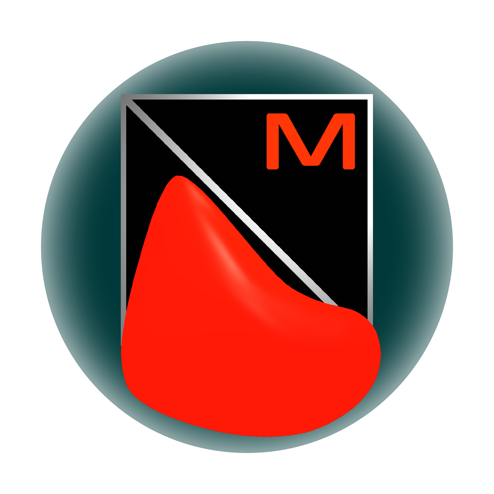
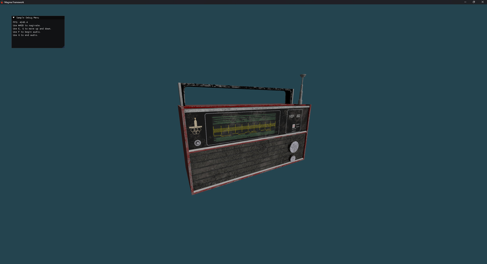

# Magma Framework

	

## OpenGL Game Development Framework

Magma is a small, modular OpenGL 3D rendering framework that's was made to serve as a template for
OpenGL projects. If anyone wants to learn, experiment, or skip the first steps of making their own game or game engine entirely,
then this project is for you!

## Free + Open Source

Magma is ALL YOURS. It has the MIT license so feel free to do with it as you please. My intention was to have a repository that I can fork
into various game related projects of mine.

## How to Use

Install Visual Studio 2022+, clone the repository, then open VS Solution. Build settings can be found in CMakeLists.txt.

## Documentation

None. I hope my comments are enough :)

## Demo

I have set up a demo scene utilizing every component that's included to hopefully give users a headstart
into understanding and making the code their own. (Demo song used - Pick It Up by Michael Wyckoff)

